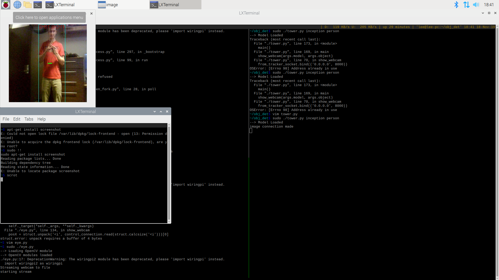

# ECE434: Sauron - All Seeing Eye

## Introduction:
We are using tensor flow and Open-CV to detect items in the frame of a web camera.
The camera is mounted onto a tilt pan kit to allow us to track the objects in frame as well.
Due to the intensive nature of the object detection, we are using a local computation server to process the image and find the objects within it.
The computation server returns a processed image and error vector which the Pi coverts to a control vector.
It can then display the processed image and adjust its angle to keep the tracked object in the middle of the frame.
In order to dramatically decrease the complexity of the project, we would have liked to preform all the processing on the Pi as well however we were unable to get a reasonable response time with either the Pi or the Beagle Bone.
The Raspberry Pi takes at least 3 seconds per image to process and the BeagleBone Black atleast 5 seconds.

## Requirements:  
### Host server: 
* python3
* opencv-python
* numpy  

### Pi:  
* python3
* opencv-python  
* simple-pid  

### Installing Requirements
Use install_host.sh and install_pi.sh to automatically install requirements.

Host: 
```
apt-get install python3 python3-pip
pip3 install opencv-python numpy
```

Pi: 
```
apt-get install python3 python3-pip
pip3 install opencv-python simple-pid
```

## Setup:  

### IP Address setup:
First get the IP addresses of both the compute server and the SBC client. Note if these devices are not on the same local area network, the server must be globally port forwarded to allow for access over the network.  
Upon doing so, enter the server's IP address in eye.py for the value of server_ip. And similarily enter the SBC client's IP in tower.py for the value of client_ip.  

## Running:   

First on server run: 
```
./tower.py <model_name> <object to track>
```

Then on the SBC client:  
```
./eye.py
```

## Operation:  
The operation of the program on the pi is shown below:  

